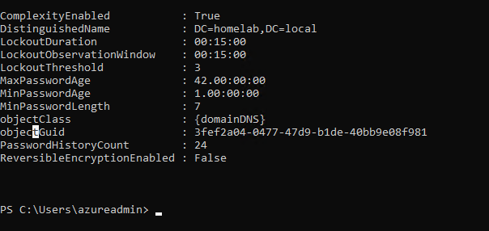
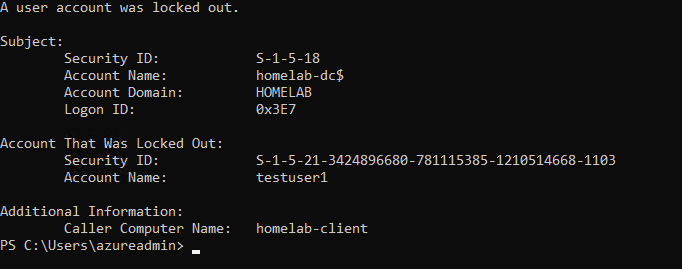
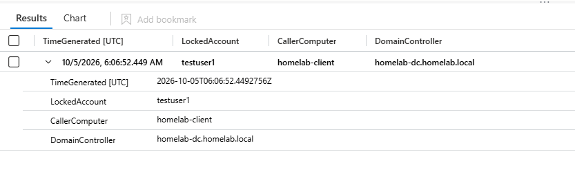

# Detection: Account Lockout Monitoring

## Why this one

Account lockouts sit right on the line between IT and security. For a help desk, a lockout is one of the most common tickets in an Active Directory environment, usually a forgotten password. For a SOC, the same event can be the first visible sign of password guessing or spraying, which is why lockouts are a common input for SIEM alerting. I wanted to answer the two questions both teams ask first: who got locked out, and from which machine.

## Making lockouts possible

Active Directory ships with the lockout threshold set to 0, which means accounts never lock no matter how many bad passwords they get. No lockout means no event 4740, so there is nothing to detect until that changes. I set a threshold on the domain:

```powershell
Set-ADDefaultDomainPasswordPolicy -Identity homelab.local -LockoutThreshold 3 -LockoutObservationWindow 00:15:00 -LockoutDuration 00:15:00
Get-ADDefaultDomainPasswordPolicy
```



Three bad passwords locks an account for 15 minutes. The observation window cannot be longer than the duration, which is why both are 15 minutes. One thing I kept in mind: this is a domain wide policy, so it applies to my own admin account too, not just the test user.

## Simulating it

From homelab-client, I made four bad password attempts against testuser1, the regular test account, using an SMB connection to the domain controller:

```powershell
1..4 | ForEach-Object { net use \\homelab-dc\IPC$ /user:HOMELAB\testuser1 "WrongPass$_" 2>$null }
```

The third attempt locks the account and the fourth hits one that is already locked. The errors are hidden on purpose, since the failures are the point.

## Confirming the domain controller logged it

Before involving Sentinel, I checked that the domain controller itself recorded the lockout, the same habit from my Splunk lab of verifying locally before trusting the SIEM.

```powershell
Get-WinEvent -FilterHashtable @{LogName='Security'; Id=4740} -MaxEvents 1 | Select-Object -ExpandProperty Message
```



There it was. testuser1 is the locked account, the domain controller is the Subject reporting it, and the Caller Computer Name is homelab-client, which ties the lockout to the machine the bad attempts came from.

## The detection

```kusto
SecurityEvent
| where EventID == 4740
| project TimeGenerated, LockedAccount = TargetUserName, CallerComputer = TargetDomainName, DomainController = Computer
| sort by TimeGenerated desc
```



The lockout reached Sentinel about 30 seconds after it happened (generated at 06:06:52, collected at 06:07:20). Sentinel shows time in UTC, so it appears as the next morning even though I ran it the night before.

## A field that looks like one thing and means another

The raw Sentinel row had an Account column reading homelab-client\testuser1, which looks like a local account on the client machine. It is not. testuser1 is a domain account, and that prefix is only the caller computer. In a 4740 event the TargetDomainName field holds the machine the bad attempts came from, not a domain. I renamed it CallerComputer in the query so the output says what it means.

I ran into the same kind of problem in my [4625 investigation](https://github.com/sramzi123/splunk-sysmon-detection-lab/blob/main/docs/analysis-4625-baseline-vs-anomaly.md) in the Splunk lab, where a field was telling me something other than what its label suggested. Reading the field before trusting the label helped me both times.

## What this does not tell you

A lockout alone does not say why it happened. Someone fumbling a password they changed yesterday and someone guessing passwords look the same at this point. This detection tells you who got locked out and from where, and a person still has to decide what it means. It also only sees the lockout itself, not the failed logons leading up to it, and I did not look at those.

## ATT&CK mapping

This is primarily an IT operations detection. The related technique is T1110, Brute Force, since repeated bad passwords can be a sign of password guessing, but a lockout by itself is not evidence of an attack.

## What I would do differently next time

I would build a Sentinel analytics rule from this so it alerts instead of waiting for me to run a query. I would also look at the failed logon events that come before the lockout, and check for one caller computer locking out many different accounts, which would look a lot more like password spraying than a forgotten password.
