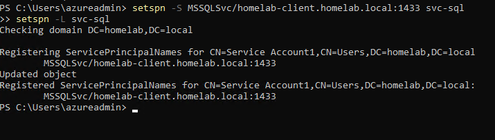
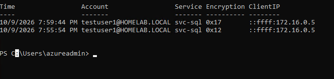
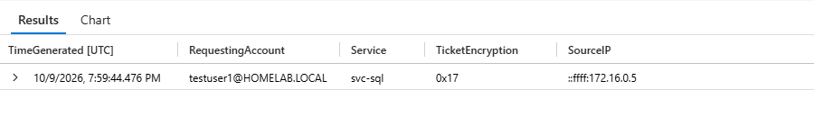
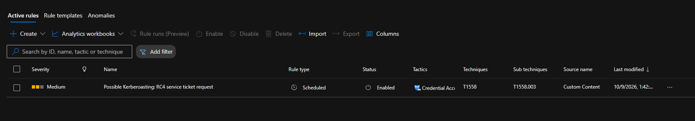
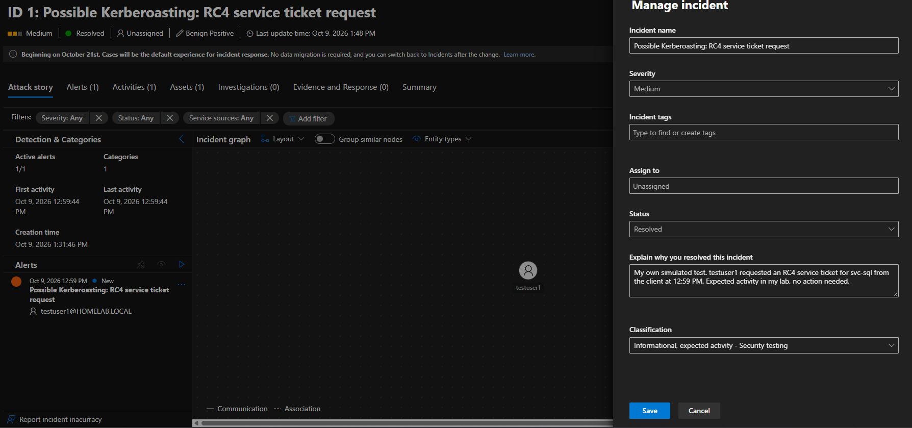

# Detection: Kerberoasting

## Why this one

Kerberoasting is a classic Active Directory attack. Any domain user can ask for a Kerberos service ticket for any account that has a service principal name (SPN), and part of that ticket is encrypted with the service account's password. An attacker takes the ticket offline and tries to crack it. The request looks like normal Kerberos traffic, so the best chance to catch it is the ticket request itself, event 4769. This is the cybersecurity detection in this lab, and I wanted to see how much of it I could spot with a single event.

## Setting up a target

I needed a service account with an SPN. I used svc-sql, a test account, and registered a fake SQL service on the client:

```powershell
setspn -S MSSQLSvc/homelab-client.homelab.local:1433 svc-sql
setspn -L svc-sql
```



Nothing is actually running on port 1433. The SPN is all the attack needs.

## Simulating it

I signed in to homelab-client as testuser1, a regular domain user (confirmed with `whoami`), and requested a ticket for that SPN:

```powershell
Add-Type -AssemblyName System.IdentityModel
New-Object System.IdentityModel.Tokens.KerberosRequestorSecurityToken -ArgumentList "MSSQLSvc/homelab-client.homelab.local:1433"
```

I only requested the ticket. I did not extract it or try to crack anything.

## The first ticket came back AES

The domain controller logged the request, but the encryption type was 0x12, which is AES. Modern domains use AES by default, and a detection that looks for RC4 would have missed it completely.

For the lab, I switched svc-sql to RC4 on purpose, to act like an older service account that was never updated:

```powershell
Set-ADUser svc-sql -KerberosEncryptionType RC4
```

Then I ran `klist purge` on the client so it would ask for a fresh ticket instead of reusing the cached one, and requested it again.

## Confirming the domain controller logged it

Before involving Sentinel, I checked the domain controller. To read the encryption type cleanly, I used a PowerShell command that pulls the 4769 events and lists the account, service, encryption type, and source address in a table.



Both requests are there, from testuser1 to svc-sql. The first is 0x12 and the second is 0x17, which is RC4.

## The detection

```kusto
SecurityEvent
| where EventID == 4769
| extend TicketEncryption = extract(@'Name="TicketEncryptionType">([^<]+)<', 1, EventData),
         Service = extract(@'Name="ServiceName">([^<]+)<', 1, EventData),
         RequestingAccount = extract(@'Name="TargetUserName">([^<]+)<', 1, EventData),
         SourceIP = extract(@'Name="IpAddress">([^<]+)<', 1, EventData)
| where TicketEncryption == "0x17"
| where Service !endswith "$" and Service != "krbtgt"
| project TimeGenerated, RequestingAccount, Service, TicketEncryption, SourceIP
```



The SecurityEvent table has no column for the encryption type, so I pull the values out of the raw event XML with `extract()`. I filter out computer accounts (names ending in `$`) and krbtgt, since those request tickets all the time. One row comes back: testuser1 asking for svc-sql with 0x17. Sentinel shows time in UTC, so the 7:59 PM request appears as 19:59.

## Turning it into an alert

I built a scheduled analytics rule from the query so Sentinel flags it without me running anything.



It is named Possible Kerberoasting: RC4 service ticket request, set to Medium severity, mapped to Credential Access and T1558.003, with the account tied to the RequestingAccount entity. The rule runs every five minutes but looks back an hour, because events can reach Sentinel late.

## Triaging the incident

The rule fired and created an incident. I treated it the way an analyst would, looked at the account, service, and source, and recognized it as my own test. I resolved it as Benign Positive, with the classification Informational, expected activity, and left a comment saying so.



The incident page shows local time, so the 19:59 UTC request shows as 12:59 PM. I had to remember that when matching it to the query result.

## What this does not tell you

- It misses AES. If svc-sql had stayed on AES, this rule would not have fired, even though the request was the same. An attacker can also ask for RC4 on purpose against accounts that still allow it, which is what this catches, but it is not full coverage.
- I switched svc-sql to RC4 myself so there would be something to detect. That makes this test easier than a real environment, where I would first have to find which accounts still use RC4.
- A legitimate old application can request RC4 tickets too, so a hit is a lead, not proof.
- I only simulated the ticket request. Nothing was cracked, and I did not look at what happens afterward.

## ATT&CK mapping

T1558.003, Steal or Forge Kerberos Tickets: Kerberoasting. The detection is built on the service ticket request, which is the step that gives an attacker something to crack.

## What I would do differently next time

The one request created four incidents. I set a one hour suppression on the rule and it still duplicated, so I closed the extras by hand and have not figured out why. Next time I would check how suppression and incident grouping actually behave before trusting them.

I would also add AES to the picture by looking for one account requesting tickets for many different services in a short window, since that pattern shows up no matter the encryption type. And I would keep a list of accounts with SPNs so a request for one of them stands out from ordinary service traffic.
