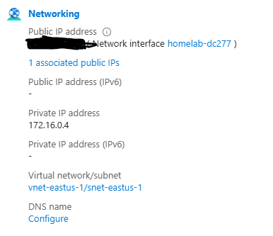
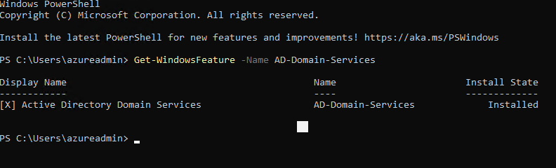
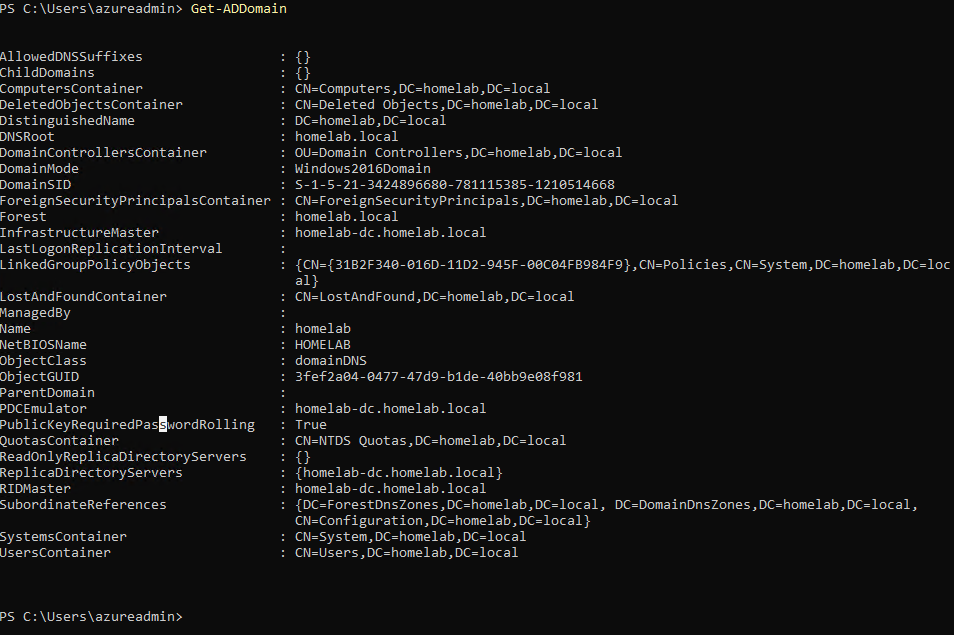
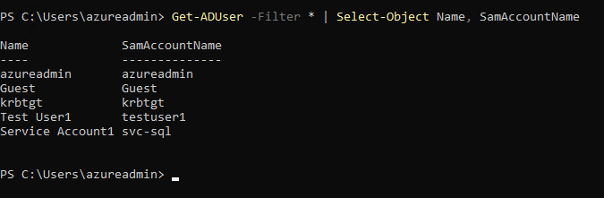
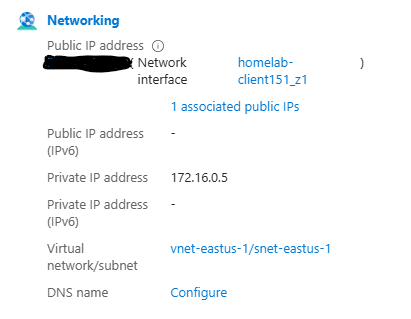
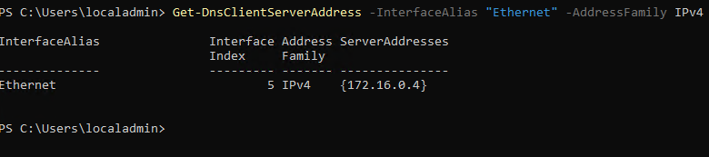
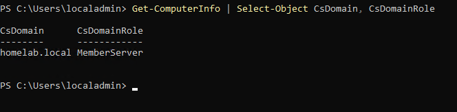
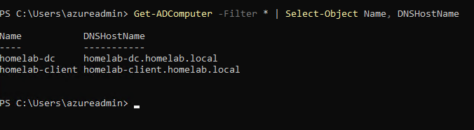

# Setup Walkthrough
 
This document covers how the lab was built: a Windows Server domain controller and a second server joined to its domain, both running in Azure. Everything here is the groundwork for the detections that come later.
 
## Prerequisites
 
An Azure free account. Portal navigation is not covered here since it changes often and is well documented. This picks up at the point where the first VM gets created.
 
## Environment
 
- Cloud: Azure free account, East US, resource group `homelab-ad-dg`
- Domain controller: `homelab-dc`, Windows Server 2022 Datacenter: Azure Edition, private IP `172.16.0.4`
- Second machine: `homelab-client`, Windows Server 2022 Datacenter: Azure Edition, private IP `172.16.0.5`
- Network: `vnet-eastus-1` and `snet-eastus-1` (`172.16.0.0/24`), shared by both machines
- Domain: `homelab.local`
## 1. Deploy the domain controller VM
 
I created `homelab-dc` from the Windows Server 2022 Datacenter: Azure Edition image and opened RDP only. The burstable B series sizes were unavailable on my subscription, even after registering the `Microsoft.Compute` resource provider, so I went with `Standard_D2as_v7` (2 vCPUs, 8 GiB). Since that size is not free tier, I deallocate the VM every time I stop working so it only bills while I am using it.
 

 
## 2. Install AD DS and promote the server
 
I installed the Active Directory Domain Services role through Server Manager, then confirmed it:
 
```powershell
Get-WindowsFeature -Name AD-Domain-Services
```
 

 
The "Promote this server to a domain controller" task was greyed out in Server Manager even though the role showed as installed, so I skipped the wizard and did the promotion in PowerShell instead:
 
```powershell
Install-ADDSForest -DomainName "homelab.local" -DomainNetbiosName "HOMELAB" -InstallDns -SafeModeAdministratorPassword (ConvertTo-SecureString "<DSRM password>" -AsPlainText -Force) -Force
```
 
The server restarts partway through, and the first boot afterward sits on "Please wait for the Group Policy Client" for a few minutes. That is normal. Once I was back in, I verified the domain:
 
```powershell
Get-ADDomain
```
 

 
## 3. Create test accounts
 
I made two accounts: a regular user, and one that will stand in as a service account later.
 
```powershell
New-ADUser -Name "Test User1" -SamAccountName "testuser1" -UserPrincipalName "testuser1@homelab.local" -AccountPassword (ConvertTo-SecureString "<password>" -AsPlainText -Force) -Enabled $true
New-ADUser -Name "Service Account1" -SamAccountName "svc-sql" -UserPrincipalName "svc-sql@homelab.local" -AccountPassword (ConvertTo-SecureString "<password>" -AsPlainText -Force) -Enabled $true
```
 
```powershell
Get-ADUser -Filter * | Select-Object Name, SamAccountName
```
 

 
## 4. Deploy the second machine on the same network
 
I wanted a Windows 11 client, but Azure requires multi tenant hosting rights to run Windows client images, and a free account does not have them. I used Windows Server 2022 again instead. For domain joins and everything Active Directory does, it behaves the same way a workstation would.
 
The setting that matters here is the virtual network. Azure defaults to creating a new one for each VM, and a machine on a separate network could never find the domain controller. I switched it to the existing `vnet-eastus-1` so both machines share a subnet.
 

 
## 5. Point the client at the domain controller for DNS
 
The client came up using Azure's default DNS (`168.63.129.16`), which knows nothing about `homelab.local`. A join attempt would have failed with a domain not found error. The domain controller is also running DNS, so I pointed the client at it:
 
```powershell
Set-DnsClientServerAddress -InterfaceAlias "Ethernet" -ServerAddresses 172.16.0.4
Get-DnsClientServerAddress -InterfaceAlias "Ethernet" -AddressFamily IPv4
```
 

 
## 6. Join the domain
 
```powershell
Add-Computer -DomainName "homelab.local" -Credential (Get-Credential) -Restart
```
 
At the credential prompt I used the domain admin account, `HOMELAB\azureadmin`. The machine restarts on its own once the join succeeds. After it came back I logged in as `.\localadmin` (the `.\` forces the local account) and checked:
 
```powershell
Get-ComputerInfo | Select-Object CsDomain, CsDomainRole
```
 

 
`CsDomainRole` says MemberServer instead of MemberWorkstation because this is a Server image, which is expected.
 
## 7. Confirm the domain controller sees the client
 
The Active Directory PowerShell module only exists on the domain controller, so this one runs there:
 
```powershell
Get-ADComputer -Filter * | Select-Object Name, DNSHostName
```
 

 
## Result
 
A working Active Directory domain in Azure with a domain controller, a joined member machine, and test accounts, ready for Defender for Endpoint onboarding and the first detections.
